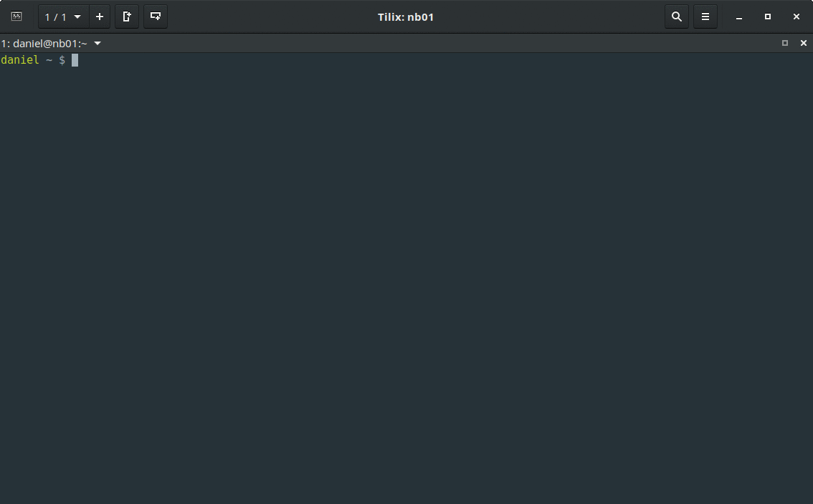

# While True Do - Bash Prompt
| A bash prompt that shows information, only if you really need them.

## Features

#### Screenshot

<small>The terminal emulator you can see here is [Tilix](https://github.com/gnunn1/tilix) (formerly known as terminix). Screenshot is taken by daniel-wtd.</small>

#### Error Display

Shows a little, red "x" at the beginning of the prompt, if the last command was not successful or returns non-zero.

#### Git integration

The usage of [git-prompt.sh](https://github.com/git/git/blob/master/contrib/completion/git-prompt.sh) is implemented and will be used, if git is installed. So you can see the git status in your prompt, when joining a git directory.

#### Coloring

Root is colored in red, systemusers in yellow and regular users in green.

#### Background Job Counter

Displays a background job counter (jobs), if there are background jobs.

#### Remote Affinity

When working locally, the prompt has no hostname. After ssh-ing into another host you can see the hostname in the prompt.

### Requirements

Git Integration is only tested on Fedora based Systems, openSUSE, archlinux and Ubuntu.

*   RedHat 7.x
*   CentOS 7.x
*   Fedora 23+
*   openSUSE 42.2
*   archlinux

## Installation
You can run the installer as root for global installation or as a user for installation in your home directory.

1.  Please Download the release package from <https://github.com/while-true-do/bash-prompt/releases>
2.  Unpack it via `unzip`
3.  Make the installer executable `chmod +x install.sh`
4.  Run the installer `./install.sh`

## Dependencies

**Git** and **git-completion** is needed, if you want to use the git-prompt.

## License

This work is licensed under a [BSD License](https://opensource.org/licenses/BSD-3-Clause).

## Contribute / Bugs

**bug reports:** <https://github.com/while-true-do/bash-prompt/issues>

**contributers:** <https://github.com/while-true-do/bash-prompt/graphs/contributors>

## Author Information

**blog:** <https://blog.while-true-do.org>

**github:** <https://github.com/daniel-wtd>

**contact:** [mail@while-true-do.org](mailto:mail@while-true-do.org)
